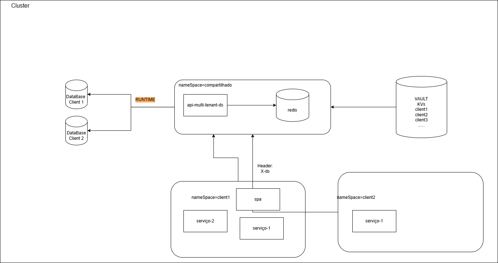

# dynamic-ds-elsql

Projeto demo Spring Boot 3 + Java 17 com:
- Datasources criados dinamicamente em runtime por tenant (X-DS header)
- JPA (Hibernate) apontando para routing datasource
- JdbcTemplate + ElSql (com arquivos .elsql) usando o datasource dinâmico

Como executar:
1. ./gradlew bootRun
2. Fazer requisições com header `X-DS: tenant1`

Endpoints:
- POST /elsql/person?name=Nome  (header X-DS)
- GET  /elsql/person            (header X-DS)
- GET  /elsql/person/search?name=ParteDoNome  (header X-DS)
- 
  

